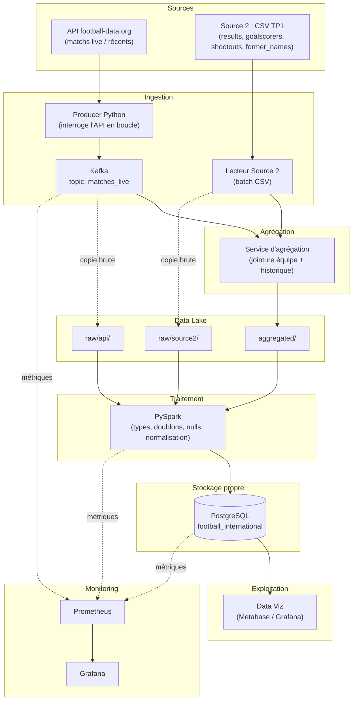

# Architecture — Pipeline Data temps réel (Football)

## Services Docker prévus

| Service | Rôle | Image de base |
|---|---|---|
| `zookeeper` | Coordination Kafka | `confluentinc/cp-zookeeper` |
| `kafka` | Broker de messages | `confluentinc/cp-kafka` |
| `producer-api` | Interroge football-data.org, publie sur Kafka | Python custom |
| `source2-reader` | Lit les CSV TP1, les copie dans le Data Lake | Python custom |
| `aggregator` | Consomme Kafka + Source 2, agrège | Python custom |
| `spark` | Traitement PySpark (raw → clean) | `bitnami/spark` |
| `postgres` | Base de données finale | `postgres:16` |
| `dataviz` | Tableau de bord | `metabase/metabase` |
| `prometheus` | Collecte des métriques | `prom/prometheus` |
| `grafana` | Visualisation du monitoring | `grafana/grafana` |

## Volumes de persistance

| Volume | Contenu |
|---|---|
| `datalake_data` | `raw/api/`, `raw/source2/`, `aggregated/` |
| `postgres_data` | Données PostgreSQL |
| `prometheus_data` | Historique des métriques |
| `grafana_data` | Dashboards Grafana |